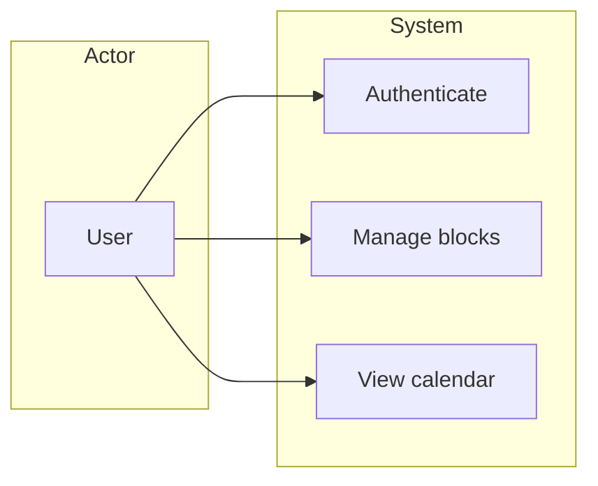

# FocusBlocks — Analysis Document

## 1. Purpose

**FocusBlocks** helps students and professionals plan days using fixed appointments and flexible study or work sessions. The app supports **personal time blocking**: users authenticate, then create, view, edit, and delete **time blocks** on a calendar. The system must prevent double-booking while allowing adjacent blocks (touching start/end times).

## 2. Problem statement

**Problem:** Calendars that only store “events” rarely encode **intent** (flexible vs locked) or enforce **non-overlap** per user at the API layer.

**Goal:** Deliver a minimal web application where each user maintains their own schedule, sees blocks in **day / week / month** views, and receives clear feedback when a change would conflict with an existing block.

## 3. Stakeholders

| Stakeholder | Interest |
|-------------|----------|
| **End user** | Reliable scheduling, simple auth, understandable errors |
| **Course / instructor** | Traceable requirements, runnable code, basic documentation |
| **Developer (maintainer)** | Small codebase, clear boundaries between UI and API |

## 4. Functional requirements

| ID | Requirement | Priority |
|----|-------------|----------|
| FR-1 | User can **register** with email and password | Must |
| FR-2 | User can **log in** and receive a session token | Must |
| FR-3 | User can **log out** (client clears token; server is stateless JWT) | Must |
| FR-4 | User can **create** a block (title, start/end, importance, optional location, type flexible/locked) | Must |
| FR-5 | User can **list** blocks for a chosen date range | Must |
| FR-6 | User can **edit** and **delete** their own blocks | Must |
| FR-7 | User sees **day**, **week**, and **month** representations | Must |
| FR-8 | System **rejects** new or updated blocks that **overlap** another block for the same user | Must |
| FR-9 | **Touching** intervals (end time equals another start) are **allowed** | Must |

## 5. Non-functional requirements

| ID | Requirement | Notes |
|----|-------------|-------|
| NFR-1 | **Security:** Passwords hashed; JWT for API access; secrets via environment variables | |
| NFR-2 | **Portability:** Runs locally with Node.js; SQLite file DB | |
| NFR-3 | **Usability:** Responsive calendar UI; errors surfaced in plain language | |
| NFR-4 | **Maintainability:** Validation schemas; automated tests for core rules | |

## 6. Constraints and assumptions

- **Single-node deployment:** One API process and one SQLite file suffice for the course scope.
- **No shared calendars:** Blocks are **private per user**; there is no team or room booking.
- **Time model:** Timestamps are stored as ISO 8601 strings; overlap logic follows a **half-open interval** interpretation documented in the design document.
- **Browser-only client:** No native mobile app.

## 7. Use cases (summary)

| Use case | Main flow | Exceptions |
|----------|-----------|--------------|
| **Register** | Submit email/password → account created → token returned | Duplicate email (409); validation errors (400) |
| **Login** | Submit credentials → token returned | Wrong credentials (401) |
| **Create block** | Submit block JSON → persisted | Overlap (409); invalid body (400) |
| **Update block** | PUT with id → updated | Not found (404); overlap (409) |
| **Delete block** | DELETE with id → removed | Not found (404) |
| **Browse calendar** | GET blocks with `start`/`end` query → rendered in UI | Unauthorized (401) |

## 8. Risks (lightweight)

| Risk | Mitigation |
|------|------------|
| Weak JWT secret in deployment | `NODE_ENV=production` requires longer secret; README documents generation |
| SQLite file lost or corrupted | Acceptable for coursework; backup file for demos |
| Clock/timezone confusion | UI uses local browser time for inputs; API stores UTC ISO strings |

## 9. Out of scope (MVP)

- Email verification, password reset, OAuth
- Recurring blocks, drag-and-drop resizing, attachments
- Hosted production deployment (optional extension)

---

*Document version: 1.0 — aligns with repository code at submission.*
