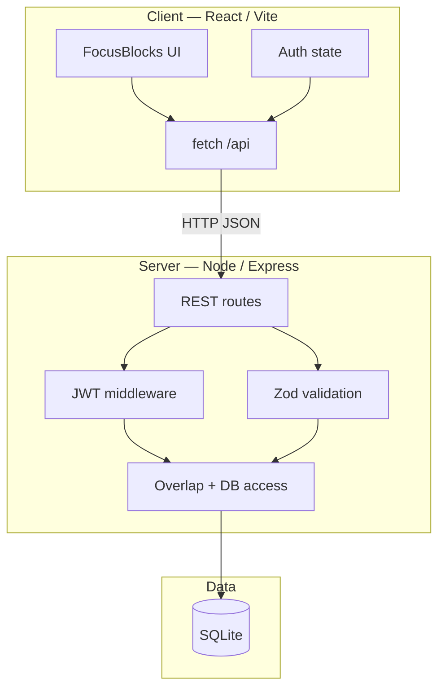
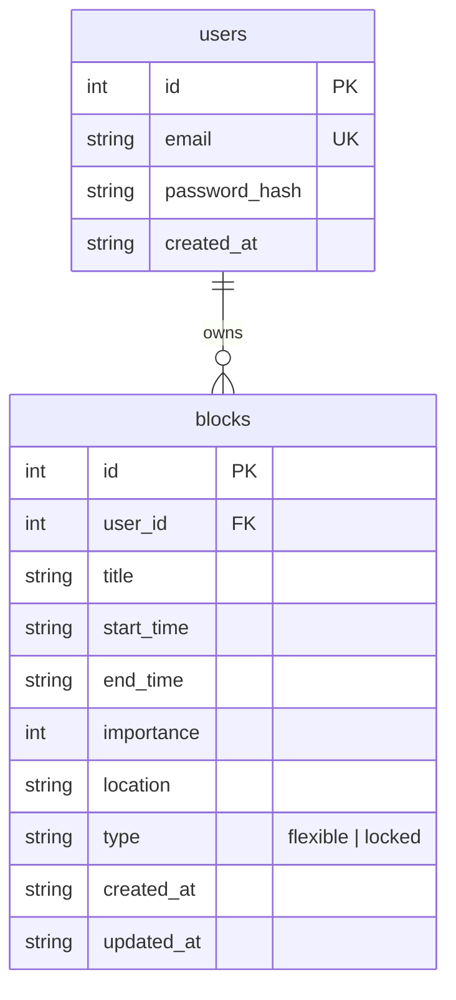
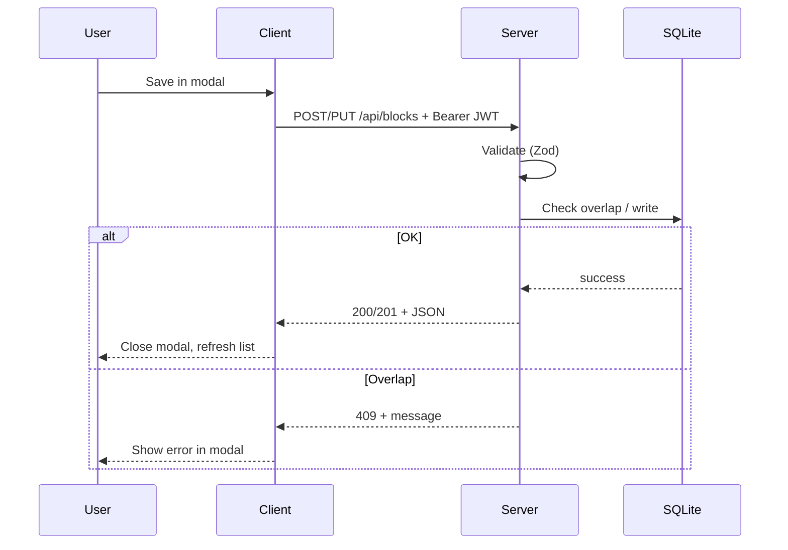

# FocusBlocks — Design Document

## 1. System overview

**FocusBlocks** uses a three-tier structure for local development:

- **Client:** Single-page app; dev server proxies `/api` to the backend.
- **Server:** Stateless JWT authentication; validates input; enforces business rules before writing SQLite.
- **Data:** Relational schema with foreign key from blocks to users.

## 2. Architectural decisions

| Decision | Choice | Rationale |
|----------|--------|-----------|
| API style | REST + JSON | Simple to test and document |
| Auth | JWT (Bearer header) | Fits stateless Express server |
| Database | SQLite (`better-sqlite3`) | Zero external DB setup for graders |
| Validation | Zod (server) | Shared schema pattern; clear error messages |
| Client routing | React Router | `/auth` vs protected `/` |
| Overlap enforcement | **Server-side only** | Client cannot bypass rules |

## 3. Time and overlap model

Blocks use ISO 8601 strings for `start_time` and `end_time`.

**Overlap rule (implemented in SQL):** For an existing row with `[start_time, end_time)` and a candidate `[newStart, newEnd)`, overlap exists when:

`NOT (existing.end_time <= newStart OR existing.start_time >= newEnd)`

Equivalently: intervals intersect with positive duration. **Touching** endpoints (e.g. existing ends exactly when new starts) yield **no overlap**, matching the product rule “back-to-back is OK.”

The API additionally rejects `end_time <= start_time` with HTTP 400.

## 4. Data model (logical)

Physical schema matches `server/db.js` (WAL mode, index on user + time columns).

## 5. API surface (summary)

| Method | Path | Auth | Description |
|--------|------|------|---------------|
| GET | `/api/health` | No | Liveness check |
| POST | `/api/auth/register` | No | Create user + return JWT |
| POST | `/api/auth/login` | No | Return JWT |
| GET | `/api/me` | Yes | Current user from token |
| GET | `/api/blocks?start=&end=` | Yes | Blocks intersecting `[start,end)` window |
| POST | `/api/blocks` | Yes | Create block |
| PUT | `/api/blocks/:id` | Yes | Update block (exclude self from overlap check) |
| DELETE | `/api/blocks/:id` | Yes | Delete block |

**Typical errors:** `400` validation, `401` missing/invalid token, `404` block not found, `409` overlap or duplicate email on register.

## 6. Client design

### 6.1 Structure

- **Pages:** `AuthPage`, `CalendarPage`
- **State:** `AuthProvider` (token in `localStorage`, `/api/me` bootstrap)
- **UI:** `TopBar`, `CalendarGrid`, `MonthCalendarGrid`, `BlockModal`
- **Networking:** Central `apiFetch` with mapped HTTP/network messages

### 6.2 View behavior (high level)

| View | Data window | Interaction highlights |
|------|-------------|-------------------------|
| Day | Single day | Click empty timeline → new block draft |
| Week | Monday–Sunday week | Same as day |
| Month | Month grid padded to weeks | Click day → day view; Shift+click → new block |

### 6.3 Sequence — save block

## 7. Configuration and security

- **Server:** `PORT`, `JWT_SECRET`, `DB_PATH`, `CLIENT_ORIGIN` loaded from `server/.env` (see `.env.example`).
- **Production:** Long `JWT_SECRET` required when `NODE_ENV=production` (see `server/config.js`).
- **CORS:** Restricted to configured browser origin(s).

## 8. Testing strategy (as implemented)

- **Server:** Node built-in test runner — overlap semantics, Zod schemas (password length, block payloads, coercion).
- **Client:** Node tests for HTTP error message mapping used by the UI.

## 9. Future extensions (not implemented)

- Recurring blocks and ICS export
- Server-side pagination for very large histories
- Docker compose for one-command demo

---

*Document version: 1.0 — aligns with repository code at submission.*
